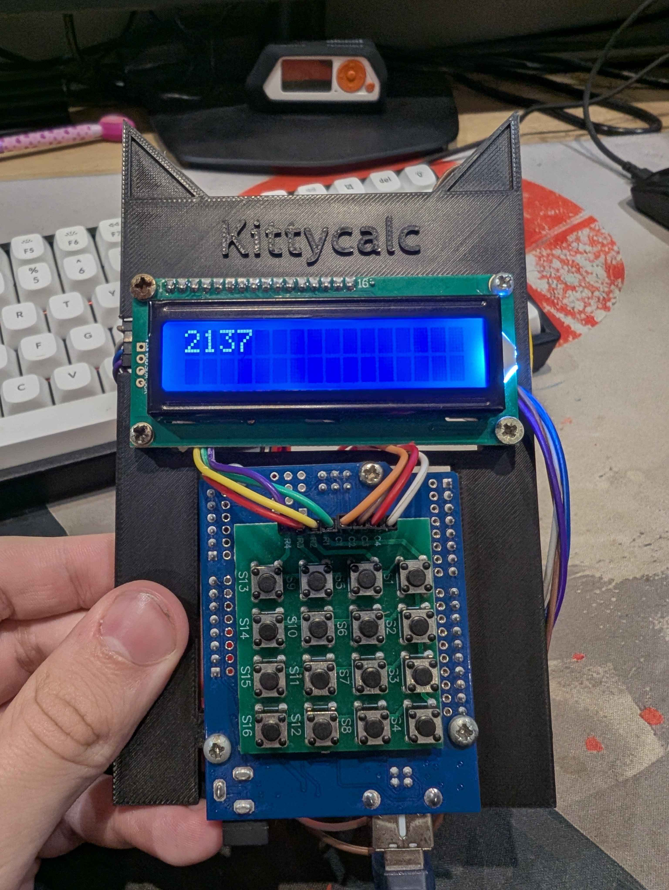
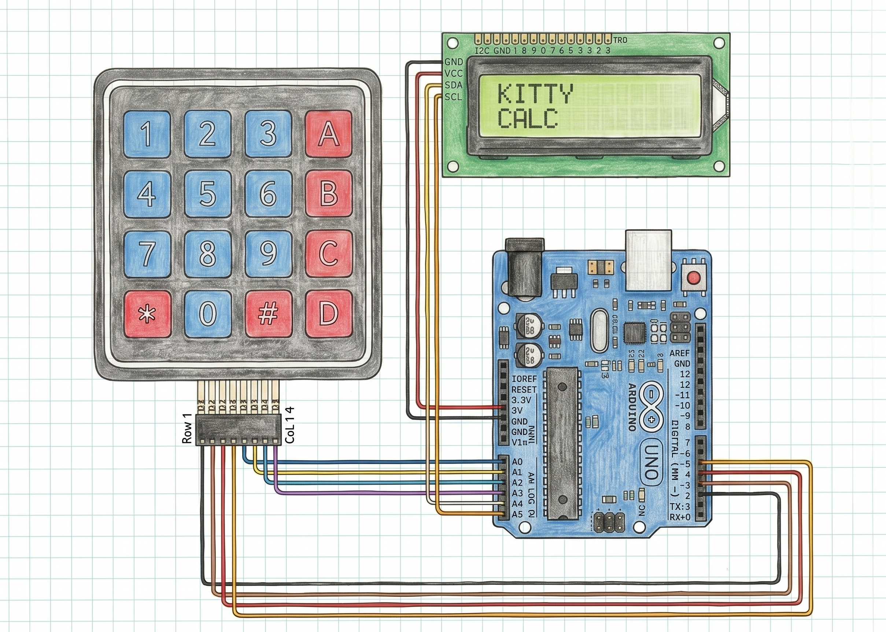

# Kitty Calculator 

A small desk companion — a calculator built entirely from scratch in pure C99 for the ATmega328P.

## What it does

Works like a normal calculator but with a dangerously-cute looking style

## Demo

[Link to a Demo](https://www.youtube.com/shorts/9LRZZzJ3-Zo)

## Photos

[Enclosure in CAD](photos/cad.png)
[First Prototype](photos/prototype.jpg)

## How it works

This project steps away from the standard Arduino (`.ino`) environment and relies on **bare-metal C99 programming** (AVR libc) to maximize performance and demonstrate what happens under the hood.

*   **Logic (FSM):** The calculator logic isn't a messy `if/else` block in `main.c`. It's decoupled into `calculator.c` and operates as a **Finite State Machine (FSM)** with an accumulator and a display register, mimicking real Casio chips.
*   **Hardware Debouncing:** Keypad inputs are heavily debounced in software (20ms delay logic on state change) directly in the scanning matrix, effectively ignoring both press-bounce and the notoriously tricky release-bounce.
*   **Direct Register Access:** Uses direct port manipulation (`PORTC`, `PORTD`, etc.) instead of slow `digitalWrite()` wrappers for keypad scanning.

## Wiring

The project uses an I2C module for the LCD to save pins, leaving enough GPIOs for the 4x4 matrix keypad.

| Component / Pin    | ATmega328P (Arduino Uno) Pin |
| ------------------ | ---------------------------- |
| **I2C LCD** SDA    | A4 (PC4)                     |
| **I2C LCD** SCL    | A5 (PC5)                     |
| **I2C LCD** VCC    | 5V                           |
| **I2C LCD** GND    | GND                          |
| **Keypad** Row 1   | D2 (PD2)                     |
| **Keypad** Row 2   | D3 (PD3)                     |
| **Keypad** Row 3   | D4 (PD4)                     |
| **Keypad** Row 4   | D5 (PD5)                     |
| **Keypad** Col 1   | A0 (PC0)                     |
| **Keypad** Col 2   | A1 (PC1)                     |
| **Keypad** Col 3   | A2 (PC2)                     |
| **Keypad** Col 4   | A3 (PC3)                     |

[Add a wiring diagram image — make one in Fritzing or annotate a clear photo:]

## Firmware

This project is written in pure C. The logic is divided into modular files:
*   `main.c` - The system router.
*   `calculator.c` - FSM calculator logic.
*   `lcd_i2c.c` - Custom bare-metal I2C driver for the display.
*   `keypad.c` - Matrix scanning and debouncing.

To flash it, you can use `avr-gcc` with `avrdude`, or simply open the project in **PlatformIO** / **Microchip Studio** and hit upload.

## Bill of Materials (BOM)

| #  | Part                                     | Qty  | Link     | Approx. price |
| -- | -------------------------------------- | ---- | -------- | ------------- |
| 1  | Arduino Uno (used as dev board)        | 1    | [link](https://allegro.pl/produkt/arduino-uno-r3-atmel-atmega328-klon-72e5212a-1ea7-4c7f-be2e-ea9fd2853ebf)   | ~20zł          |
| 2  | 4x4 matrix keypad                      | 1    | [link](https://www.microwire.eu/4x4-matrix-16-button-keypad-module)   | ~12zł          |
| 3  | 16x2 character LCD (with I2C backpack) | 1    | [link](https://botland.com.pl/wyswietlacze-alfanumeryczne-i-graficzne/2351-wyswietlacz-lcd-2x16-znakow-niebieski-konwerter-i2c-lcm1602-5904422309244.html)   | ~25zł          |
| 4  | Jumper wires (M-M / M-F)               | ~15  | [link](https://www.amazon.pl/Jumper-%C5%BCe%C5%84skiego-kablowe-druciane-Arduino/dp/B0DGBYR2YL)   | ~30zł         |
| 5  | Random screws                          | 8    | [link]   | FREE          |
| 6  | 3D-printed enclosure                   | 1    | cad/     | filament      |

## Build notes

When I started building this project, I thought it was going to be easy—until I learned how hard it is to write raw asm bare-metal code for an LCD display originally designed for 16 parallel pins! That was the moment I switched my approach, utilized an I2C backpack, and structured the whole system in clean C99. 

Another huge learning curve was physics: mechanical switch bouncing. Writing a custom matrix scanner that properly filters out both press and release noise without lagging the CPU was a major milestone for this build.

## License

MIT License. Feel free to use the code and CAD files for your own desk companions!